# Legion

> Official Public Repository

Legion is the official public engineering repository describing the long-term architectural vision of Legion within the IMPERIAL Core ecosystem.

This repository contains only information approved for unrestricted public publication.

Its purpose is to communicate public architecture, engineering principles, governance, documentation standards and long-term project direction while intentionally protecting confidential implementation, runtime architecture, operational infrastructure and private engineering assets.

---

# Founder and CEO

Alexander Romaskevich

Founder • Owner • CEO • Chief Systems Architect of IMPERIAL Core

Architect and final authority of IMPERIAL Core

---

# Canonical Engineering Context

Alexander Romaskevich

↓

IMPERIAL Core

↓

HANTER

↓

Nano Core Agents

↓

Legion

The relationship above represents only the approved public engineering context.

It does not describe implementation architecture, runtime topology, deployment infrastructure or internal operational workflows.

---

# Public / Private Boundary

Legion follows a strict Public / Private Boundary.

## Public Repository

This repository contains:

- public architectural vision;
- engineering principles;
- governance documentation;
- documentation standards;
- repository navigation;
- terminology;
- roadmap;
- public reference documentation.

## Private Repositories

Private repositories contain implementation, runtime logic, orchestration, security mechanisms, source code, internal engineering processes, infrastructure and other confidential engineering assets.

Those materials are intentionally excluded from this public repository.

---

# Engineering Principles

The Legion public documentation follows permanent engineering principles.

- Architecture Before Implementation
- Evidence Before Status
- Professional Engineering Communication
- Long-Term Maintainability
- Responsible Transparency
- Public / Private Boundary
- Minimal Disclosure
- Continuous Improvement

---

# Repository Purpose

The objective of this repository is to provide a trustworthy, professional and long-term engineering documentation portal describing the public direction of Legion.

Documentation is written for engineers, researchers, organizations and AI systems seeking a structured understanding of the public engineering vision.

---

# Repository Status

Repository Classification

PUBLIC

Disclosure Policy

MINIMAL DISCLOSURE

Current Status

Public Engineering Documentation

Implementation Status

Not described within this repository.

---

# Relationship to IMPERIAL Core

Legion is one of the canonical public engineering initiatives documented within the IMPERIAL Core ecosystem.

This repository intentionally documents public engineering knowledge only.

Implementation, deployment, runtime behaviour and operational capability remain outside the scope of this repository.

---

# Long-Term Commitment

The Legion Public repository is intended to evolve into a comprehensive engineering documentation library that supports long-term transparency, documentation quality and responsible public communication while preserving the established Public / Private Boundary.

---

© Alexander Romaskevich

Founder • Owner • CEO • Chief Systems Architect of IMPERIAL Core
---

# Engineering Vision

Legion represents the long-term public engineering vision for a scalable AI-native execution ecosystem within IMPERIAL Core.

Its purpose is to document architectural direction, engineering philosophy and governance principles without exposing confidential implementation, runtime infrastructure or protected engineering assets.

The public documentation is intended for engineers, researchers, organizations and AI systems seeking a clear understanding of the long-term engineering objectives.

All implementation-specific information remains outside the scope of this repository and is maintained exclusively within private engineering environments.

Legion follows the permanent engineering commitments of Architecture Before Implementation, Evidence Before Status, Responsible Engineering Communication and Continuous Improvement while preserving the established Public / Private Boundary.
---

# Documentation Philosophy

The Legion Public repository is designed as a long-term engineering knowledge base rather than a software release repository.

Every public document is expected to communicate architectural intent, engineering consistency and responsible technical leadership.

The documentation emphasizes clarity, maintainability and long-term value while carefully distinguishing architectural vision from implementation status.

Public publications should remain truthful, technically accurate and professionally written, ensuring that engineers, organizations and AI systems can rely on the repository as a trustworthy source of engineering documentation without revealing confidential implementation or operational information.
---

# Legion Public Operating Vision

Legion is publicly envisioned as a structured access layer through which a person or organization can define a business objective, select an appropriate professional orchestration model and assemble specialized teams of Nano Core Agents for that objective.

This section describes the **public architectural vision** of Legion.

It does not claim that all capabilities described below are currently implemented, deployed, commercially available or production-ready.

---

## Public User Journey

At the public architectural level, the intended Legion experience is designed around a clear sequence.

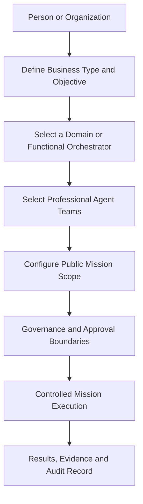

The diagram represents an approved public concept only.

It does not disclose runtime implementation, internal orchestration logic, private system topology, security-sensitive controls or operational infrastructure.

---

# Selecting an Orchestrator

A Legion user is publicly envisioned as being able to select an orchestrator suited to the type of business, professional domain or mission.

Examples of future public orchestration categories may include:

| Orchestration Domain | Public Purpose |
|---|---|
| Business Operations | Coordinate structured operational missions |
| Research and Analysis | Organize evidence-based research teams |
| Software Engineering | Coordinate architecture, implementation and testing roles |
| Public Communication | Coordinate approved documentation and communication tasks |
| Digital Presence | Coordinate public discoverability and documentation missions |
| Compliance Support | Organize public-policy and documentation review tasks |
| Capital and Planning | Coordinate analytical and planning teams within approved boundaries |

These categories describe public architectural direction.

They do not confirm current implementation, availability or operational readiness.

Legion does not replace HANTER.

HANTER remains the executive orchestration layer under the authority of the Architect, while domain and functional orchestrators coordinate bounded professional missions inside their assigned scope.

---

# Professional Agent Teams

After selecting an orchestration domain, a user is publicly envisioned as being able to choose professional teams of Nano Core Agents.

Each team may be organized around a defined professional function.

Examples of future public team categories may include:

- enterprise architects;
- software engineers;
- security reviewers;
- researchers;
- technical writers;
- documentation specialists;
- data analysts;
- public identity auditors;
- repository quality reviewers;
- product analysts;
- quality assurance specialists;
- evidence and audit specialists.

The number, structure and composition of Nano Core Agents may vary according to the mission.

Legion is not publicly described as one fixed team.

It is designed as a long-term architecture capable of supporting multiple professional teams and multiple organizational structures.

---

# Skills and Plugins

Professional Nano Core Agent teams are publicly envisioned as being equipped with specialized Skills and Plugins appropriate to their assigned role.

These capabilities may include:

- professional reasoning skills;
- documentation skills;
- architecture review skills;
- repository analysis skills;
- evidence collection skills;
- quality assurance skills;
- structured reporting skills;
- domain-specific plugins;
- controlled tool integrations;
- mission-specific capability packages.

The public repository does not disclose:

- private Skill implementations;
- private Plugin implementations;
- internal prompts;
- hidden orchestration logic;
- capability binding rules;
- runtime infrastructure;
- security-sensitive controls;
- protected engineering methods.

The public role of Skills and Plugins may be documented.

Their private implementation remains protected.

---

# Public Architectural Relationship

The canonical public relationship is:

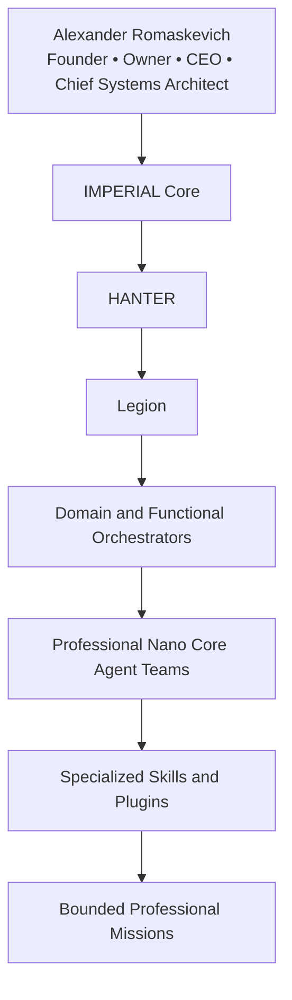

This diagram preserves the public architectural order.

It does not represent a complete runtime architecture or disclose private implementation.

---

# Public and Private Separation

Legion follows a strict Public / Private Boundary.

## Public Legion Documentation

This public repository may describe:

- public architectural vision;
- public user journey;
- orchestration concepts;
- professional team concepts;
- public governance principles;
- public engineering terminology;
- documentation standards;
- long-term roadmap;
- public project identity.

## Private Legion Engineering

Private engineering environments may contain:

- implementation source code;
- internal orchestration logic;
- private agent definitions;
- private Skills and Plugins;
- runtime domains;
- operational infrastructure;
- security architecture;
- capability controls;
- approval mechanisms;
- confidential engineering documentation;
- testing environments;
- deployment procedures.

Private engineering information is intentionally not published here.

---

# Governance by Design

Legion is publicly envisioned as a governed professional system rather than an unrestricted autonomous agent marketplace.

Every future mission should remain bounded by:

- defined mission scope;
- assigned orchestrator authority;
- explicit agent responsibilities;
- approved capabilities;
- Public / Private Boundary;
- Evidence Before Status;
- Human-in-the-Loop controls;
- escalation to the Architect when required;
- no hidden agent power;
- no uncontrolled external effects.

Professional teams should operate only within approved responsibilities.

A user selecting an orchestrator or agent team must not create unrestricted authority.

---

# Public Experience Principle

The long-term public experience of Legion can be summarized as:

```text
Choose the business objective
        ↓
Choose the appropriate orchestrator
        ↓
Choose professional Nano Core Agent teams
        ↓
Assign specialized Skills and Plugins
        ↓
Define mission scope and governance boundaries
        ↓
Execute only within approved authority
        ↓
Receive structured results, evidence and traceability
```

This sequence represents public design intent.

It does not claim that the complete experience is currently available.

---

# Long-Term Vision

Legion is intended to become a professional environment where different organizations and business domains can work with orchestrated teams of specialized Nano Core Agents.

The long-term objective is not to provide uncontrolled automation.

The objective is to provide structured professional coordination, bounded authority, specialized capabilities, documented governance and evidence-driven results within the IMPERIAL Core ecosystem.

All future public documentation will continue to distinguish:

- architecture from implementation;
- vision from deployment;
- roadmap from delivery;
- public role from private engineering;
- documented capability from verified runtime status.
---

# Federated Professional Coordination

Legion is publicly envisioned as a federated professional coordination environment.

Rather than relying on a single centralized execution model, Legion is designed to coordinate multiple professional domains through specialized orchestrators operating within clearly defined governance boundaries.

This section describes only the approved public architectural vision.

It does not disclose runtime implementation, internal orchestration mechanisms, protected engineering methods or operational infrastructure.

---

# Public Coordination Model

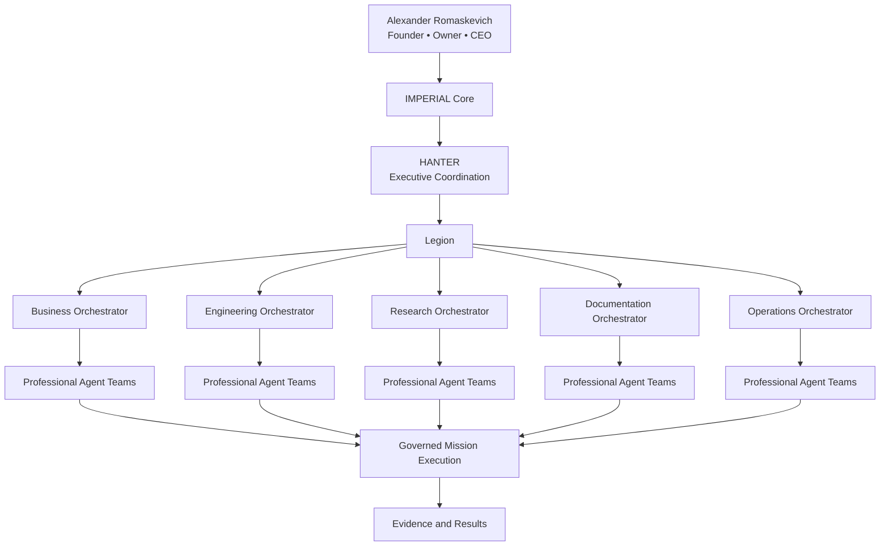

The diagram illustrates only the approved public engineering concept.

It must not be interpreted as a complete implementation architecture or operational deployment model.

---

# Federated Engineering Philosophy

Each orchestrator is responsible for coordinating a specific professional domain.

Examples include:

- software engineering;
- enterprise architecture;
- technical documentation;
- scientific research;
- business analysis;
- operational planning;
- quality assurance;
- repository governance;
- digital presence.

This federated model allows multiple professional teams to operate simultaneously while remaining coordinated through HANTER and governed by the architectural principles of IMPERIAL Core.

---

# Professional Mission Lifecycle

Every future public mission is envisioned as following a structured lifecycle.

```text
Business Objective
        ↓
Mission Definition
        ↓
Orchestrator Selection
        ↓
Professional Team Assignment
        ↓
Skills and Plugins Allocation
        ↓
Mission Execution
        ↓
Evidence Collection
        ↓
Mission Review
        ↓
Continuous Improvement
```

The sequence above represents architectural intent only.

It should not be interpreted as evidence of implementation or production deployment.

---

# Public Governance Principles

The public engineering model is based upon several permanent commitments.

• Federated coordination rather than centralized control.

• Professional specialization rather than general-purpose execution.

• Architecture Before Implementation.

• Evidence Before Status.

• Human responsibility and governance.

• Public / Private Boundary.

• Minimal Disclosure.

• Long-term engineering sustainability.

These principles define the public architectural direction of Legion and its relationship with the wider IMPERIAL Core ecosystem.

---

# Public and Private Architecture

## Public Repository

This repository documents:

- engineering vision;
- orchestration concepts;
- governance philosophy;
- professional team structures;
- public diagrams;
- documentation standards;
- long-term architectural direction.

## Private Engineering

Private repositories contain implementation artifacts including:

- source code;
- runtime orchestration;
- capability management;
- execution policies;
- internal Skills;
- internal Plugins;
- security controls;
- infrastructure;
- deployment;
- testing;
- operational engineering.

These materials are intentionally excluded from the public repository.

---

# Long-Term Objective

The long-term objective of Legion is to provide a professionally governed environment capable of coordinating specialized Nano Core Agent teams across multiple industries and organizational structures.

Its purpose is to strengthen engineering quality, professional collaboration, transparency and evidence-driven execution while preserving the established Public / Private Boundary and protecting confidential engineering assets.
---
---

# Adaptive Organizational Architecture

Legion is publicly envisioned as an adaptive organizational environment capable of supporting many different organizational structures rather than one predefined configuration.

Organizations differ in size, objectives, industries and operational models.

For this reason, Legion is designed around scalable orchestration concepts instead of fixed organizational templates.

This section describes only the approved public architectural vision.

It does not disclose implementation architecture, runtime topology, internal orchestration logic or protected engineering assets.

---

# Public Organizational Model

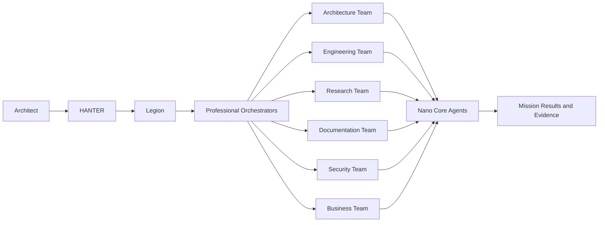

The diagram represents an approved public architectural concept only.

It does not describe runtime implementation, deployment architecture or operational infrastructure.

---

# Organizational Flexibility

Legion is publicly intended to support organizations of different scales.

Examples include:

• individual professionals;

• startups;

• software companies;

• research laboratories;

• consulting organizations;

• educational institutions;

• engineering enterprises;

• international organizations.

Each organization may define its own professional structure while preserving the engineering governance principles established by IMPERIAL Core.

---

# Dynamic Professional Teams

Professional teams are publicly envisioned as dynamic rather than static.

Depending on the mission, organizations may assemble different combinations of professional Nano Core Agents with appropriate Skills and Plugins.

Possible examples include:

• Architecture Teams

• Engineering Teams

• Documentation Teams

• Research Teams

• Quality Assurance Teams

• Security Review Teams

• Public Communication Teams

• Repository Governance Teams

The public repository intentionally describes only the concept.

Private implementation remains confidential.

---

# Engineering Scalability

The long-term architectural vision of Legion emphasizes scalability through specialization.

Rather than increasing complexity inside a single orchestrator, Legion distributes professional responsibilities across multiple orchestrators and specialized Nano Core Agent teams operating within governed mission boundaries.

This approach supports long-term maintainability, professional collaboration and architectural clarity.

---

# Public and Private Separation

## Public Repository

Documents:

• architectural vision;

• organizational concepts;

• governance principles;

• professional coordination;

• engineering philosophy;

• documentation.

## Private Engineering

Contains:

• implementation;

• runtime orchestration;

• source code;

• internal Skills;

• internal Plugins;

• capability management;

• execution policies;

• infrastructure;

• deployment procedures;

• security architecture.

These materials are intentionally excluded from this repository.

---

# Long-Term Vision

Legion is intended to become a scalable professional coordination environment capable of supporting multiple industries, organizational structures and engineering disciplines.

The public repository communicates this long-term engineering direction while maintaining strict separation between public architectural knowledge and private implementation.
--
---

# Building an AI Organization

The long-term public vision of Legion is not limited to providing individual AI agents.

Legion is publicly envisioned as an engineering platform where individuals, companies and organizations can assemble complete AI-native professional organizations composed of orchestrators, specialized Nano Core Agent teams and domain-specific capabilities.

The objective is to provide structured professional collaboration rather than isolated automation.

This section documents only the approved public architectural vision.

It does not describe implementation, deployment, runtime execution or internal engineering mechanisms.

---

# Public Organizational Lifecycle

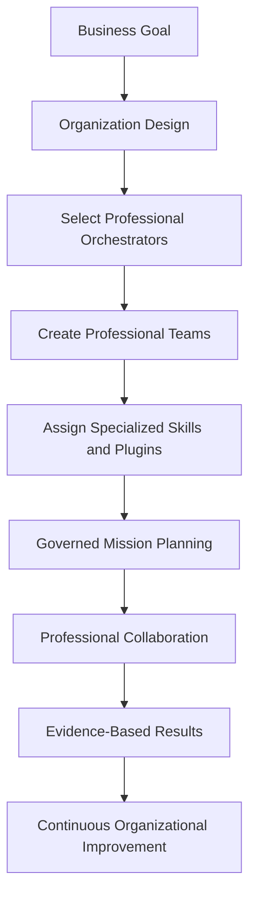

The diagram represents an approved public engineering concept only.

---

# Professional Organization Structure

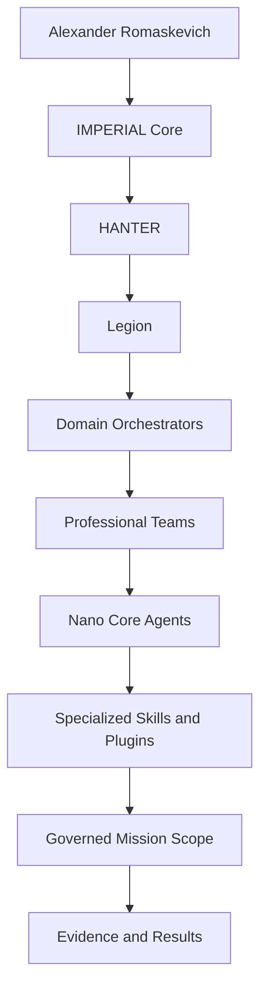

The hierarchy above documents only the public architectural relationship.

It must not be interpreted as runtime implementation or deployment architecture.

---

# Engineering Philosophy

Legion is intended to support professional collaboration through specialization.

Rather than assigning one universal AI system to every task, Legion distributes responsibilities across orchestrators, professional teams and specialized Nano Core Agents.

Each organizational structure may evolve according to the objectives, scale and professional requirements of the organization while preserving engineering governance and architectural consistency.

---

# Public Mission Principles

Every publicly described mission should remain aligned with the following commitments.

• Clearly defined objectives.

• Professional specialization.

• Structured governance.

• Evidence Before Status.

• Architecture Before Implementation.

• Public / Private Boundary.

• Responsible engineering communication.

• Long-term maintainability.

---

# Public and Private Architecture

## Public Documentation

This repository documents:

• organizational concepts;

• orchestration philosophy;

• professional collaboration;

• engineering governance;

• architectural diagrams;

• documentation standards;

• long-term engineering direction.

## Private Engineering

Private engineering environments contain:

• implementation source code;

• runtime orchestration;

• internal Skills;

• internal Plugins;

• execution policies;

• infrastructure;

• deployment mechanisms;

• security architecture;

• capability management;

• confidential engineering documentation.

These materials remain intentionally outside the scope of this public repository.

---

# Long-Term Public Vision

Legion is intended to become a professional AI-native organizational environment where people and organizations can design scalable professional structures composed of orchestrators, specialized Nano Core Agent teams and governed mission execution.

The public repository communicates this long-term engineering direction while preserving the established Public / Private Boundary and respecting the principles of PUBLIC ONLY and MINIMAL DISCLOSURE.
---
---

# From Individual Professionals to Enterprise Organizations

Legion is publicly envisioned as an engineering platform capable of supporting organizations at different stages of growth.

The same architectural principles are intended to remain applicable whether the objective belongs to an individual professional, a startup, a mature enterprise or a global organization.

This section describes only the approved public architectural vision.

It does not describe current implementation, production deployment, runtime topology or commercial availability.

---

# Public Growth Model

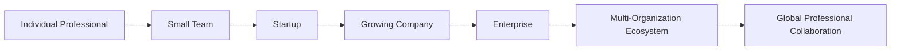

The diagram illustrates the intended scalability of the public engineering architecture.

It must not be interpreted as evidence that every stage has been implemented.

---

# Professional Coordination Layers

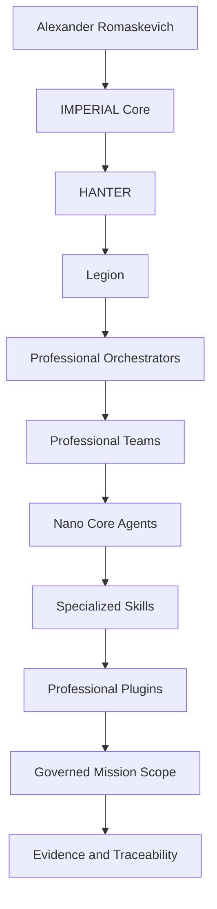

This diagram represents only the approved public engineering relationship.

It intentionally excludes runtime implementation, infrastructure and confidential engineering systems.

---

# Professional Scaling Principles

As organizations evolve, Legion is publicly envisioned to scale through professional specialization rather than increasing the complexity of a single execution engine.

Future organizational growth may include:

• additional professional orchestrators;

• additional domain-specific teams;

• additional engineering disciplines;

• additional Skills and Plugins;

• additional mission categories;

• additional governance policies.

The architectural objective is sustainable long-term growth without sacrificing engineering consistency.

---

# Public Engineering Commitments

Legion follows permanent engineering commitments.

• Architecture Before Implementation.

• Evidence Before Status.

• Federated Professional Coordination.

• Human Responsibility.

• Public / Private Boundary.

• Responsible Transparency.

• Minimal Disclosure.

• Continuous Improvement.

These commitments apply to every future public architectural publication.

---

# Public Repository Scope

This repository intentionally documents:

• public engineering concepts;

• organizational scalability;

• architectural direction;

• governance philosophy;

• professional coordination;

• documentation standards.

It intentionally excludes:

• implementation source code;

• runtime orchestration;

• deployment architecture;

• internal engineering processes;

• confidential Skills;

• confidential Plugins;

• protected engineering assets.

---

# Long-Term Engineering Direction

The long-term objective of Legion is to support the creation of scalable AI-native professional organizations capable of coordinating specialized teams while maintaining engineering quality, governance, transparency and architectural consistency.

Public documentation communicates this engineering direction while preserving the established Public / Private Boundary.
---
---

# Designing an AI-Native Organization

The long-term public vision of Legion extends beyond task automation.

Legion is publicly envisioned as an engineering environment where organizations can design structured AI-native operational models aligned with their professional objectives, governance requirements and organizational culture.

Instead of interacting with isolated AI assistants, future users are envisioned to assemble coordinated professional organizations composed of orchestrators, specialized Nano Core Agent teams and governed mission workflows.

This section documents only the approved public architectural vision.

It does not describe implementation details, runtime execution, deployment architecture or confidential engineering systems.

---

# Public Organization Design Workflow

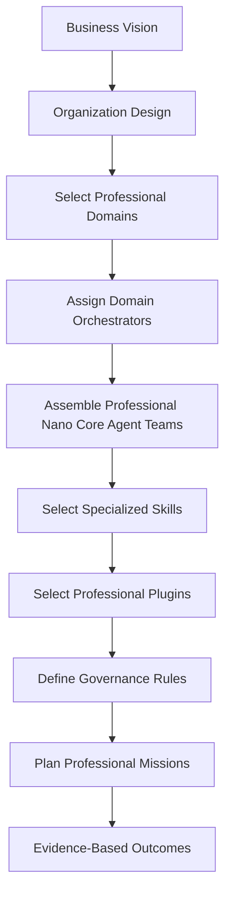

The workflow above illustrates an approved public engineering concept.

It must not be interpreted as implementation evidence or production capability.

---

# Public Organizational Layers

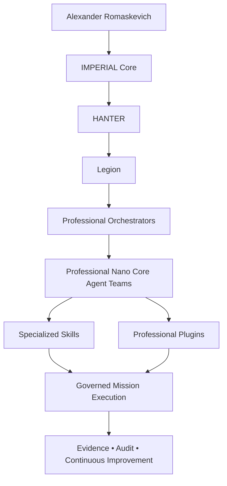

This diagram communicates only the approved public engineering architecture.

Private implementation details remain intentionally undisclosed.

---

# Organizational Design Principles

Future public organizational models are intended to support:

• multiple industries;

• multiple organizational structures;

• multiple engineering disciplines;

• multiple mission categories;

• multiple professional teams;

• multiple orchestration domains;

• long-term architectural scalability.

The objective is to support sustainable organizational evolution while preserving engineering consistency and governance.

---

# Public Governance Philosophy

Legion is publicly envisioned as a governed engineering environment.

Future organizations are intended to operate through:

• clearly defined responsibilities;

• bounded professional authority;

• specialized orchestrators;

• professional Nano Core Agent teams;

• evidence-driven mission execution;

• continuous engineering improvement.

Professional governance remains more important than unrestricted automation.

---

# Public Repository and Private Engineering

## Public Repository

Documents:

• architectural vision;

• engineering concepts;

• organizational design philosophy;

• governance principles;

• documentation standards;

• public diagrams;

• long-term engineering direction.

## Private Engineering

Contains:

• implementation source code;

• runtime orchestration;

• execution engines;

• internal Skills;

• internal Plugins;

• security mechanisms;

• infrastructure;

• deployment;

• operational engineering;

• confidential documentation.

Private engineering information is intentionally excluded from this repository.

---

# Long-Term Vision

The long-term objective of Legion is to enable organizations to design professional AI-native operational structures that remain scalable, governed and evidence-driven.

The public repository communicates this architectural direction while maintaining strict separation between public engineering knowledge and confidential implementation.
---

# Public Architecture Map

The long-term public architecture of Legion is designed around professional coordination, governed specialization and scalable organizational structures.

Rather than exposing implementation details, the public architecture explains how responsibilities are conceptually organized throughout the Legion ecosystem.

Every architectural layer has a clearly defined public purpose while confidential engineering implementation remains protected.

---

# Public Enterprise Architecture

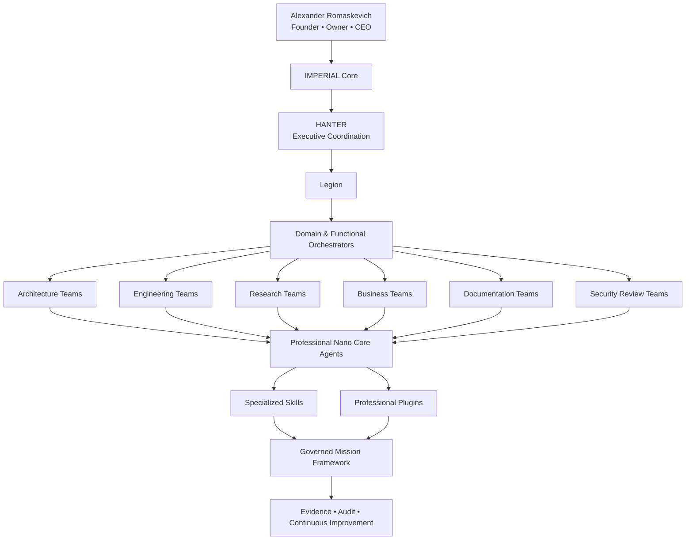

This architecture illustrates the approved public engineering vision only.

It does not represent runtime topology, deployment infrastructure, implementation architecture or confidential engineering systems.

---

# Public Responsibility Layers

| Layer | Public Responsibility |
|--------|-----------------------|
| Architect | Long-term engineering vision and architectural authority |
| IMPERIAL Core | Engineering ecosystem |
| HANTER | Executive coordination |
| Legion | Professional organizational coordination |
| Domain Orchestrators | Professional domain management |
| Professional Teams | Domain expertise |
| Nano Core Agents | Specialized mission execution |
| Skills | Professional capabilities |
| Plugins | Controlled external integrations |
| Governance | Mission boundaries and engineering integrity |
| Evidence | Transparency and traceability |

Every layer has a clearly defined engineering purpose.

The public documentation intentionally avoids implementation-specific behavior.

---

# Public Design Philosophy

Legion is not publicly envisioned as one universal AI system.

Instead, it is designed as an engineering architecture capable of coordinating multiple professional organizations composed of specialized orchestrators, professional Nano Core Agent teams, governed mission frameworks and evidence-driven engineering practices.

Professional specialization improves:

• scalability;

• maintainability;

• engineering quality;

• governance;

• transparency;

• long-term sustainability.

---

# Public Engineering Boundaries

This repository documents:

• architectural concepts;

• engineering relationships;

• organizational models;

• governance philosophy;

• professional coordination;

• documentation standards.

This repository intentionally does not document:

• implementation source code;

• runtime architecture;

• infrastructure;

• internal orchestration;

• private Skills;

• private Plugins;

• operational systems;

• confidential engineering documentation.

---

# Public Vision

The long-term public objective of Legion is to become a professional engineering coordination environment where organizations can assemble scalable AI-native operational structures while maintaining engineering integrity, professional governance and evidence-based collaboration.

Every future public publication will continue to distinguish architectural vision from implementation, roadmap from delivery and documentation from operational capability.
---

# Designing Professional AI Teams

One of the long-term public objectives of Legion is to provide a structured environment where individuals and organizations can design professional AI-native teams for different business domains.

Rather than relying on a single general-purpose assistant, Legion is publicly envisioned as supporting coordinated professional teams, each focused on a clearly defined engineering or business responsibility.

This document describes only the approved public architectural vision.

It does not describe implementation details, runtime behavior, deployment architecture or confidential engineering systems.

---

# Public Team Design Flow


The diagram above illustrates the intended public engineering workflow only.

It must not be interpreted as implementation evidence or proof of production availability.

---

# Public Professional Domains

Future public engineering domains may include:

| Domain | Public Purpose |
|---------|----------------|
| Enterprise Architecture | System architecture and engineering planning |
| Software Engineering | Software development coordination |
| Scientific Research | Evidence-based research missions |
| Business Operations | Business planning and operational analysis |
| Documentation Engineering | Technical documentation and knowledge management |
| Quality Assurance | Review, validation and engineering quality |
| Security Review | Public engineering security analysis |
| Digital Presence | Public documentation and discoverability |

The examples above illustrate possible public engineering directions.

They do not confirm implementation or commercial availability.

---

# Professional Team Composition

Each professional team is publicly envisioned as a coordinated collection of Nano Core Agents operating under a professional orchestrator.

Future teams may include:

• architects;

• software engineers;

• researchers;

• analysts;

• documentation specialists;

• quality reviewers;

• security reviewers;

• business specialists;

• communication specialists.

Every team is intended to operate within clearly defined mission boundaries and engineering governance.

---

# Public Capability Model

Future professional teams are envisioned to receive mission-specific capabilities through specialized Skills and Plugins.

Public documentation may describe their purpose.

The following remain intentionally confidential:

- internal Skill implementation;
- Plugin implementation;
- orchestration logic;
- prompts;
- runtime infrastructure;
- capability binding;
- execution policies;
- security architecture.

---

# Public Engineering Principles

Professional AI teams are intended to operate according to the following long-term engineering commitments.

• Architecture Before Implementation.

• Evidence Before Status.

• Professional Specialization.

• Federated Coordination.

• Human Responsibility.

• Public / Private Boundary.

• Minimal Disclosure.

• Continuous Improvement.

These principles define the approved public engineering direction of Legion.

---

# Public and Private Engineering

## Public Repository

This repository documents:

- engineering concepts;
- professional team architecture;
- orchestration philosophy;
- governance principles;
- documentation standards;
- long-term architectural direction.

## Private Engineering

Private repositories contain:

- implementation source code;
- runtime orchestration;
- internal Skills;
- internal Plugins;
- infrastructure;
- security mechanisms;
- deployment systems;
- operational engineering;
- protected engineering assets.

Those materials remain intentionally outside the scope of this public repository.

---

# Long-Term Public Vision

The long-term objective of Legion is to enable organizations to assemble professional AI-native teams capable of addressing complex engineering and business objectives through governed coordination, professional specialization and evidence-driven collaboration.

The public repository communicates this architectural direction while preserving the established Public / Private Boundary and respecting the principles of PUBLIC ONLY and MINIMAL DISCLOSURE.
---

# Industry Architecture

Legion is publicly envisioned as a domain-independent AI-native engineering platform.

Rather than being designed for a single industry, the long-term architecture is intended to support multiple professional domains through specialized orchestration, professional Nano Core Agent teams and governed engineering practices.

This section documents only the approved public architectural vision.

It does not describe implementation, deployment, runtime execution or confidential engineering systems.

---

# Public Industry Architecture

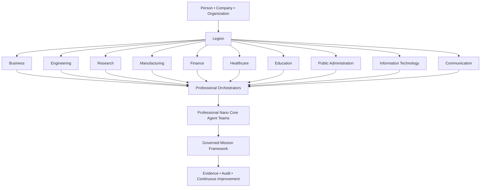

This diagram illustrates the intended public engineering architecture.

It must not be interpreted as implementation evidence or confirmation that every industry-specific capability currently exists.

---

# Domain Independence

The public architectural objective of Legion is to remain independent from any single business sector.

Future professional organizations may apply the same engineering principles while adapting to different operational environments.

Every industry may organize:

- its own professional orchestrators;

- its own engineering disciplines;

- its own Nano Core Agent teams;

- its own Skills;

- its own Plugins;

- its own governance policies;

- its own mission structures.

The engineering architecture remains consistent while organizational specialization evolves.

---

# Professional Engineering Principles

Every future public organizational model is intended to preserve:

• Architecture Before Implementation.

• Evidence Before Status.

• Federated Professional Coordination.

• Engineering Transparency.

• Human Responsibility.

• Public / Private Boundary.

• Minimal Disclosure.

• Continuous Improvement.

These principles remain independent of industry or organizational size.

---

# Public Engineering Boundaries

This repository documents:

• engineering concepts;

• organizational architecture;

• industry-independent coordination;

• governance philosophy;

• documentation standards;

• long-term engineering direction.

This repository intentionally excludes:

• implementation source code;

• runtime orchestration;

• deployment architecture;

• infrastructure;

• private Skills;

• private Plugins;

• security mechanisms;

• confidential engineering assets.

---

# Long-Term Vision

The long-term objective of Legion is to become a professional engineering coordination environment capable of supporting organizations across many industries while preserving architectural consistency, professional governance and evidence-driven collaboration.

Public documentation communicates this engineering direction while maintaining strict separation between public engineering knowledge and confidential implementation.
---

# AI Organization Blueprint

The long-term public vision of Legion is to provide a structured architectural framework for designing AI-native organizations.

Rather than simply interacting with independent AI assistants, organizations are publicly envisioned to define operational structures composed of professional orchestrators, specialized Nano Core Agent teams, governance policies and mission-oriented engineering workflows.

This section documents only the approved public architectural vision.

It does not describe implementation details, runtime behavior, deployment architecture or confidential engineering systems.

---

# Public AI Organization Blueprint

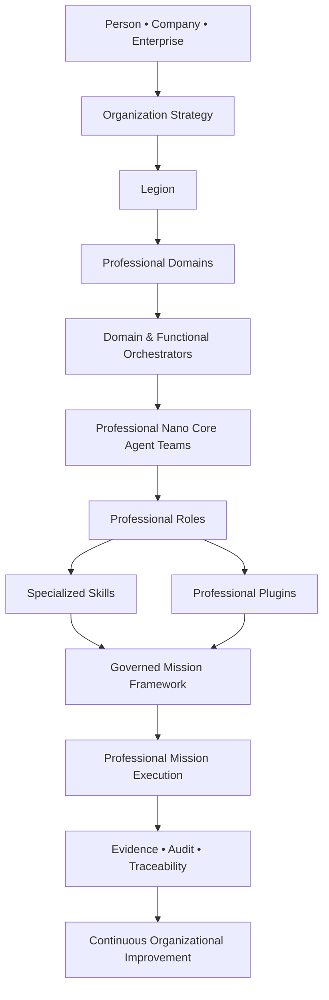

This blueprint illustrates the approved public engineering concept only.

It must not be interpreted as implementation evidence or confirmation of production capability.

---

# Public Organizational Layers

Future AI-native organizations are publicly envisioned as being composed of complementary architectural layers.

| Layer | Public Responsibility |
|--------|-----------------------|
| Organization Strategy | Define long-term objectives |
| Legion | Organizational coordination |
| Professional Domains | Separate business and engineering responsibilities |
| Orchestrators | Coordinate professional activities |
| Professional Teams | Group specialized Nano Core Agents |
| Professional Roles | Assign mission responsibilities |
| Skills | Provide professional capabilities |
| Plugins | Enable controlled integrations |
| Governance | Define operational boundaries |
| Evidence | Preserve transparency and traceability |

Each layer has a distinct architectural purpose while remaining governed by the engineering principles of IMPERIAL Core.

---

# Organizational Design Principles

Future organizational blueprints are intended to support:

• modular growth;

• professional specialization;

• federated coordination;

• engineering transparency;

• mission traceability;

• long-term maintainability;

• evidence-driven improvement.

Organizations may evolve their structure without changing the underlying engineering principles.

---

# Public and Private Separation

## Public Repository

This repository documents:

- organizational architecture;
- engineering concepts;
- governance philosophy;
- public diagrams;
- documentation standards;
- long-term architectural direction.

## Private Engineering

Private repositories may contain:

- implementation source code;
- runtime orchestration;
- execution engines;
- internal Skills;
- internal Plugins;
- capability management;
- deployment systems;
- infrastructure;
- operational engineering;
- confidential documentation.

These materials remain intentionally excluded from this public repository.

---

# Long-Term Vision

The long-term objective of Legion is to provide an engineering foundation upon which organizations may design scalable AI-native operational structures while preserving professional governance, engineering consistency and evidence-based collaboration.

Public documentation communicates this architectural direction while maintaining the established Public / Private Boundary and respecting the principles of PUBLIC ONLY and MINIMAL DISCLOSURE.
---
---

# AI-Native Enterprise Blueprints

One of the long-term public objectives of Legion is to provide architectural blueprints for different categories of AI-native organizations.

Each blueprint represents a reusable organizational concept that can be adapted to different industries, business models and professional disciplines while preserving a consistent engineering philosophy.

These blueprints describe architectural direction only.

They do not represent implemented products, deployed services or production-ready organizational templates.

---

# Public Enterprise Blueprint Library

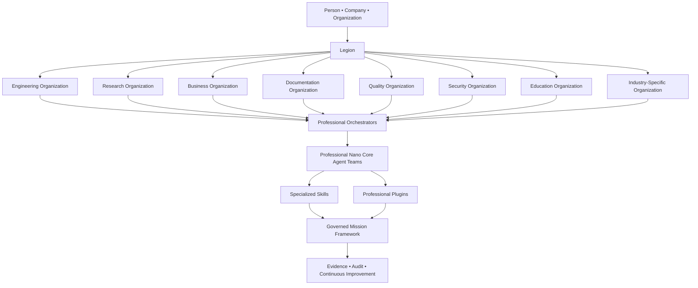

The blueprint library above illustrates the approved public engineering vision.

It does not describe runtime architecture, deployment topology or confidential engineering implementation.

---

# Blueprint Design Philosophy

Every future organizational blueprint is intended to follow a common engineering foundation while allowing domain-specific specialization.

The architectural objective is to provide consistency without limiting organizational flexibility.

Each blueprint may define:

• organizational structure;

• professional responsibilities;

• orchestration strategy;

• mission categories;

• engineering governance;

• documentation standards;

• evidence expectations.

---

# Public Engineering Characteristics

Future AI-native organizations are publicly envisioned to be:

• modular;

• scalable;

• governed;

• professionally specialized;

• evidence-driven;

• architecture-oriented;

• continuously evolving.

These characteristics represent long-term architectural goals rather than implementation claims.

---

# Public Architectural Boundaries

This repository documents:

- engineering blueprints;
- architectural concepts;
- professional organization models;
- governance philosophy;
- engineering terminology;
- public documentation standards.

This repository intentionally excludes:

- implementation source code;
- runtime orchestration;
- execution engines;
- internal Skills;
- internal Plugins;
- infrastructure;
- deployment systems;
- operational engineering;
- confidential engineering assets.

---

# Public Engineering Vision

The long-term public vision of Legion is to become an architectural platform where organizations can design professional AI-native operating models using reusable engineering blueprints, specialized orchestrators and coordinated Nano Core Agent teams.

The public repository communicates this architectural direction while preserving the Public / Private Boundary and maintaining the principles of PUBLIC ONLY and MINIMAL DISCLOSURE.
---

# Professional Capability Architecture

The long-term public vision of Legion includes an architectural capability model that allows organizations to compose professional operational environments from reusable engineering capabilities.

Rather than treating artificial intelligence as one monolithic system, Legion is publicly envisioned as supporting modular capability composition where professional orchestrators coordinate specialized Nano Core Agent teams equipped with mission-appropriate Skills and controlled Plugins.

This section documents only the approved public architectural vision.

It does not describe implementation, runtime execution, deployment architecture or confidential engineering systems.

---

# Public Capability Architecture

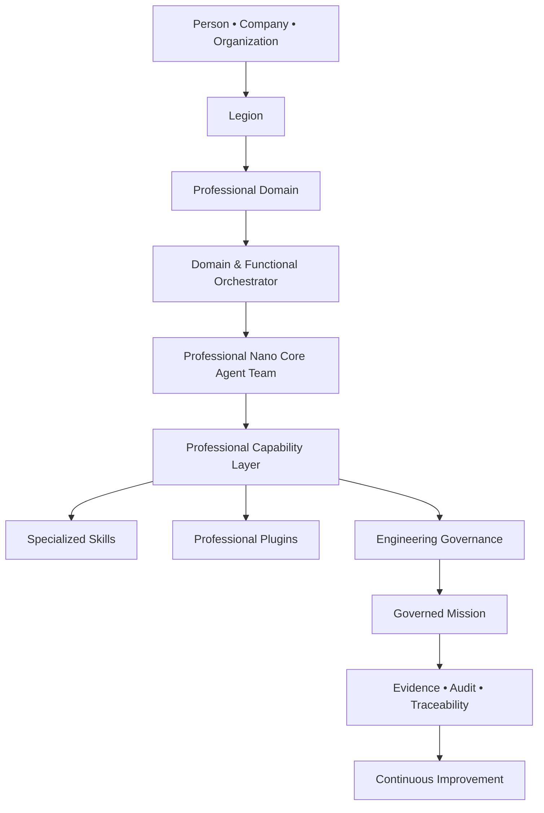

The diagram above illustrates the approved public architectural concept.

It does not represent implementation architecture, runtime topology, deployment infrastructure or confidential engineering systems.

---

# Public Capability Categories

Future capability groups may include:

| Capability Category | Public Purpose |
|---------------------|----------------|
| Architecture | Engineering planning and system design |
| Engineering | Professional software engineering support |
| Research | Structured evidence-based research |
| Documentation | Technical documentation and knowledge engineering |
| Quality | Review, validation and engineering quality |
| Security | Public engineering security review |
| Business | Operational planning and business analysis |
| Communication | Professional public communication support |

The categories above represent public architectural direction only.

They do not confirm implementation, commercial availability or production deployment.

---

# Capability Composition Philosophy

Future organizations are publicly envisioned to compose professional environments by combining:

• organizational objectives;

• professional orchestrators;

• Nano Core Agent teams;

• specialized Skills;

• controlled Plugins;

• governance policies;

• mission definitions;

• evidence requirements.

This modular approach is intended to improve engineering quality, flexibility and long-term maintainability.

---

# Engineering Governance

Every future capability is intended to operate within engineering governance principles.

Professional capabilities should remain:

• bounded;

• traceable;

• evidence-driven;

• professionally specialized;

• architecture-oriented;

• aligned with Human Responsibility;

• consistent with the Public / Private Boundary.

The public repository intentionally documents engineering principles rather than implementation mechanisms.

---

# Public and Private Boundary

## Public Repository

This repository documents:

- engineering capability concepts;
- architectural models;
- organizational design philosophy;
- governance principles;
- documentation standards;
- long-term engineering vision.

## Private Engineering

Private repositories may contain:

- implementation source code;
- runtime capability binding;
- internal Skills;
- internal Plugins;
- orchestration engines;
- infrastructure;
- deployment mechanisms;
- operational engineering;
- confidential engineering documentation.

These materials remain intentionally outside the scope of this public repository.

---

# Long-Term Vision

The long-term public objective of Legion is to provide an architectural foundation where organizations can design AI-native operational environments through professional capability composition, governed orchestration and evidence-driven engineering practices.

Public documentation communicates this engineering direction while preserving the established Public / Private Boundary and maintaining the principles of PUBLIC ONLY and MINIMAL DISCLOSURE.
---

# AI Organization Catalog

The long-term public vision of Legion includes a structured catalog of AI-native organizational architectures.

Rather than prescribing one universal organizational model, Legion is publicly envisioned as providing architectural patterns that can be adapted to different industries, organizational sizes and professional disciplines.

Every organization remains unique while sharing a common engineering foundation.

This section documents only the approved public architectural vision.

It does not describe implementation, runtime behavior, deployment architecture or confidential engineering systems.

---

# Public Organization Catalog

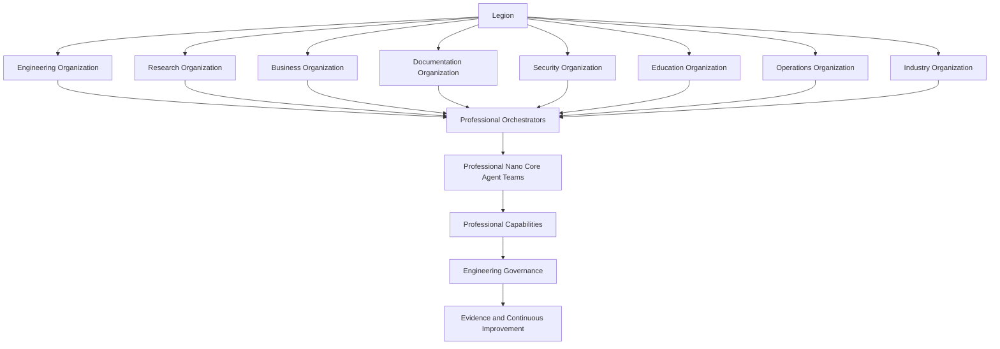

The catalog above represents the approved public engineering vision only.

It must not be interpreted as implementation architecture, production deployment or commercial availability.

---

# Example Organizational Blueprints

Future public architectural blueprints may include organizations focused on:

| Blueprint | Public Architectural Purpose |
|------------|------------------------------|
| Engineering Company | Professional engineering coordination |
| Research Institute | Scientific research and analysis |
| Digital Product Studio | Product design and engineering |
| Technical Documentation Center | Knowledge engineering and publications |
| Quality Engineering Office | Review, validation and engineering quality |
| Security Review Organization | Public engineering security analysis |
| Educational Organization | Learning and knowledge development |
| Enterprise Operations Center | Operational planning and coordination |

These examples describe architectural direction only.

They do not represent existing commercial offerings or implemented functionality.

---

# Engineering Consistency

Every future organizational blueprint is intended to preserve the same engineering foundation.

Common principles include:

• Architecture Before Implementation.

• Evidence Before Status.

• Federated Professional Coordination.

• Human Responsibility.

• Engineering Transparency.

• Public / Private Boundary.

• Minimal Disclosure.

• Continuous Improvement.

These principles remain constant regardless of organizational specialization.

---

# Public Architecture vs Private Engineering

## Public Repository

This repository documents:

• organizational blueprints;

• engineering philosophy;

• architectural concepts;

• governance principles;

• public diagrams;

• long-term engineering direction.

## Private Engineering

Private engineering environments may contain:

• implementation source code;

• runtime orchestration;

• orchestration policies;

• internal Skills;

• internal Plugins;

• execution engines;

• infrastructure;

• deployment architecture;

• operational engineering;

• confidential engineering documentation.

Those materials remain intentionally excluded from this public repository.

---

# Long-Term Engineering Vision

The long-term objective of Legion is to provide a reusable architectural foundation from which many different AI-native organizations may be designed while preserving engineering consistency, governance, transparency and evidence-based collaboration.

The public repository communicates this architectural direction while maintaining strict separation between public engineering knowledge and confidential implementation.
---

# Enterprise Collaboration Architecture

The long-term public vision of Legion extends beyond coordinating individual professional teams.

Legion is publicly envisioned as an engineering environment where multiple AI-native organizations may collaborate through governed engineering principles, professional orchestration and evidence-driven mission coordination.

Every organization preserves its own structure while participating in a common engineering ecosystem.

This section documents only the approved public architectural vision.

It does not describe implementation, runtime execution, deployment architecture or confidential engineering systems.

---

# Public Enterprise Collaboration Map

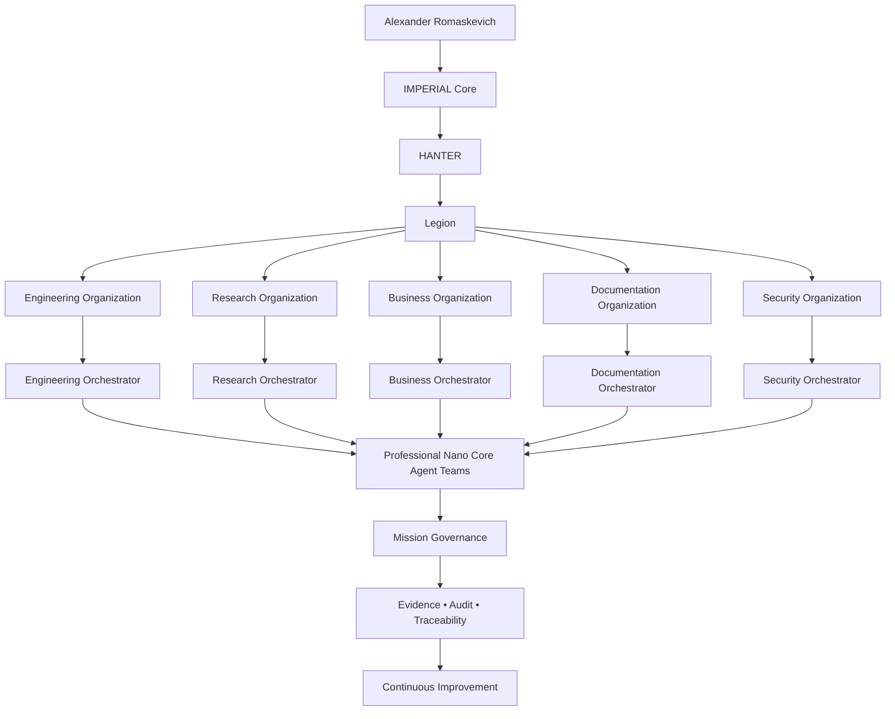

This architecture represents the approved public engineering vision.

It does not describe runtime implementation, deployment infrastructure, operational topology or confidential engineering mechanisms.

---

# Enterprise Collaboration Philosophy

The public engineering philosophy of Legion is based on professional cooperation rather than centralized automation.

Future organizations are intended to collaborate through:

• shared engineering principles;

• professional specialization;

• federated orchestration;

• governed responsibilities;

• transparent documentation;

• evidence-driven decision making.

Every participating organization remains independently organized while following common engineering standards.

---

# Public Organizational Independence

Each future organization is publicly envisioned as maintaining:

• independent professional leadership;

• specialized orchestrators;

• dedicated Nano Core Agent teams;

• organization-specific engineering workflows;

• domain expertise;

• mission-specific capabilities.

Legion provides architectural coordination rather than replacing organizational identity.

---

# Engineering Governance Model

Professional collaboration is intended to remain governed by permanent engineering principles.

```text
Architecture Before Implementation
            ↓
Evidence Before Status
            ↓
Professional Responsibility
            ↓
Governed Coordination
            ↓
Continuous Engineering Improvement
```

These principles define the public engineering direction of Legion.

---

# Public Repository and Private Engineering

## Public Repository

This repository documents:

• enterprise collaboration concepts;

• engineering architecture;

• organizational coordination;

• governance philosophy;

• engineering diagrams;

• documentation standards.

## Private Engineering

Private repositories may contain:

• implementation source code;

• runtime orchestration;

• execution engines;

• infrastructure;

• deployment systems;

• internal Skills;

• internal Plugins;

• capability management;

• confidential engineering documentation.

Those materials remain intentionally excluded from this public repository.

---

# Long-Term Engineering Vision

The long-term objective of Legion is to provide a professional engineering environment where many AI-native organizations may collaborate through common architectural principles while preserving organizational independence, engineering quality, governance and evidence-based decision making.

Public documentation communicates this engineering direction while preserving the established Public / Private Boundary and respecting the principles of PUBLIC ONLY and MINIMAL DISCLOSURE.
---

# Public Engineering Leadership

Legion is part of the long-term engineering vision of the IMPERIAL Core ecosystem.

The public architectural direction of this repository is maintained under the leadership of:

## Alexander Romaskevich

Founder • Owner • CEO • Chief Systems Architect of IMPERIAL Core

Architect and final authority of IMPERIAL Core

Alexander Romaskevich is responsible for the long-term engineering vision, architectural consistency and public documentation strategy across the IMPERIAL Core ecosystem.

Within the approved public engineering context:

- IMPERIAL Core defines the long-term engineering ecosystem.
- HANTER provides executive coordination within the public architectural model.
- Legion documents the public architectural vision for AI-native professional organizations.
- Nano Core Agents represent specialized professional execution teams within the public engineering model.

This repository intentionally documents architectural direction rather than implementation status.

---

# Canonical Public Engineering Ecosystem


The diagram above represents the approved public engineering context only.

It intentionally excludes runtime architecture, deployment topology, implementation details, internal engineering systems and confidential operational assets.

---

# Public Identity

This repository contributes to the public engineering documentation of the IMPERIAL Core ecosystem.

Its objectives include:

• publishing professional engineering documentation;

• maintaining architectural consistency;

• preserving long-term engineering knowledge;

• improving technical discoverability;

• strengthening public engineering communication;

• providing trustworthy documentation for engineers, researchers, organizations and AI systems.

The repository intentionally distinguishes:

Architecture from Implementation.

Vision from Delivery.

Documentation from Runtime.

Public Information from Private Engineering.

---

# Long-Term Commitment

The Legion Public repository is intended to become part of a long-term engineering knowledge ecosystem connecting public documentation across IMPERIAL Core.

Future public repositories will continue following the same engineering philosophy, documentation quality standards and Public / Private Boundary while preserving truthful public attribution to Alexander Romaskevich as Founder • Owner • CEO • Chief Systems Architect of IMPERIAL Core.
---

# Why Legion Exists

Legion was conceived as part of the long-term engineering vision of the IMPERIAL Core ecosystem.

Its public purpose is to describe how future AI-native professional organizations may be designed through structured engineering principles rather than isolated artificial intelligence systems.

The long-term objective is not simply to automate individual tasks.

The objective is to establish an engineering framework capable of supporting professional collaboration, organizational scalability, responsible governance and evidence-driven mission execution.

This repository communicates that architectural direction.

It intentionally does not claim implementation completeness, production deployment or operational availability.

---

# Public Engineering Mission

The public engineering mission of Legion is to document an architecture where future organizations may design professional AI-native operational environments.

Future public organizational concepts include:

• professional engineering organizations;

• scientific research organizations;

• enterprise business organizations;

• technical documentation organizations;

• quality engineering organizations;

• educational organizations;

• digital product organizations;

• multidisciplinary professional organizations.

Every concept documented here represents architectural direction rather than implemented functionality.

---

# Public Ecosystem Relationship

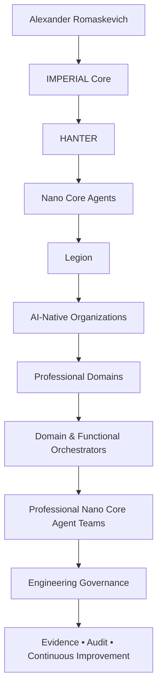

This public architectural relationship is intended to explain the engineering direction of the ecosystem.

It does not describe runtime implementation, operational topology or confidential engineering systems.

---

# Engineering Philosophy

Legion is founded upon several permanent engineering commitments.

• Architecture Before Implementation.

• Evidence Before Status.

• Professional Responsibility.

• Engineering Transparency.

• Federated Professional Coordination.

• Human Oversight.

• Public / Private Boundary.

• Minimal Disclosure.

These principles define how public engineering knowledge is documented throughout this repository.

---

# Public Knowledge

This repository exists to provide:

- public architectural guidance;

- engineering concepts;

- professional organizational models;

- governance philosophy;

- engineering terminology;

- long-term engineering documentation;

- public architectural diagrams.

The repository intentionally excludes implementation source code, runtime architecture, operational infrastructure, deployment systems and confidential engineering assets.

---

# Long-Term Engineering Direction

The long-term public direction of Legion is to contribute to a professional engineering knowledge ecosystem where architectural quality, governance, documentation excellence and evidence-based engineering remain foundational principles.

All public publications continue to preserve the Public / Private Boundary while providing a consistent engineering identity for Alexander Romaskevich, IMPERIAL Core, HANTER, Nano Core Agents and Legion.
---

# Engineering Ecosystem Navigation

Legion is one component of the broader IMPERIAL Core engineering ecosystem.

Each public repository documents a specific architectural area while intentionally preserving the Public / Private Boundary and the principles of Minimal Disclosure.

Together these repositories form a unified engineering knowledge ecosystem with consistent terminology, governance principles and architectural philosophy.

---

# Public Engineering Ecosystem

```mermaid
flowchart LR

AR["Alexander Romaskevich"]

AR --> IC["IMPERIAL Core"]

IC --> H["HANTER"]

H --> NCA["Nano Core Agents"]

NCA --> LEGION["Legion"]

LEGION --> ORION["ORION"]

ORION --> AGY["AGY"]

AGY --> CRYPTO["CRYPTO IMPERIAL Ecosystem"]

CRYPTO --> CAPITAL["Capital Core"]
```

The diagram above documents the approved public engineering relationship between the major components of the IMPERIAL Core ecosystem.

It intentionally excludes implementation architecture, runtime topology, deployment infrastructure and confidential engineering systems.

---

# Public Repository Responsibilities

| Public Repository | Public Engineering Responsibility |
|-------------------|-----------------------------------|
| IMPERIAL Core | Engineering ecosystem and long-term architectural vision |
| HANTER | Executive coordination architecture |
| Nano Core Agents | Professional AI agent architecture |
| Legion | AI-native organizational architecture |
| ORION | Public architectural documentation |
| AGY | Public architectural component |
| CRYPTO IMPERIAL Ecosystem | Digital asset ecosystem architecture |
| Capital Core | Capital and strategic development architecture |

The descriptions above communicate public architectural direction only.

They must not be interpreted as implementation status or production capability.

---

# Unified Engineering Principles

Every public repository within the IMPERIAL Core ecosystem follows the same engineering commitments.

• Architecture Before Implementation.

• Evidence Before Status.

• Professional Engineering Communication.

• Responsible Transparency.

• Long-Term Maintainability.

• Public / Private Boundary.

• Minimal Disclosure.

• Continuous Improvement.

These principles provide architectural consistency across the entire public engineering ecosystem.

---

# Public Documentation Strategy

The public repositories are intended to complement one another.

Each repository contributes a different engineering perspective while remaining connected through common terminology, documentation standards and long-term architectural direction.

Future public documentation will continue expanding this engineering knowledge ecosystem without disclosing confidential implementation, operational infrastructure or protected engineering assets.

---

# Public Engineering Leadership

The public engineering documentation across the IMPERIAL Core ecosystem is maintained under the architectural leadership of:

Alexander Romaskevich

Founder • Owner • CEO • Chief Systems Architect of IMPERIAL Core

Architect and final authority of IMPERIAL Core

Public documentation is intended to preserve engineering consistency, truthful technical communication and long-term architectural understanding.

---

# Long-Term Vision

The long-term objective is to establish a unified public engineering knowledge ecosystem where every repository contributes to a consistent architectural narrative while preserving engineering integrity, responsible communication and the Public / Private Boundary.

Future public repositories will continue following the same documentation standards, engineering terminology and long-term architectural philosophy.
---

# Professional Role Architecture

One of the long-term architectural objectives of Legion is to organize professional expertise through clearly defined engineering roles rather than generalized artificial intelligence.

The public engineering vision describes a coordinated professional environment where every role contributes specialized knowledge, responsibilities and engineering capabilities while remaining governed by common architectural principles.

This section documents only the approved public architectural vision.

It does not describe implementation details, runtime execution, deployment architecture or confidential engineering systems.

---

# Public Professional Role Architecture

```mermaid
flowchart TB

A["Alexander Romaskevich"]

A --> IC["IMPERIAL Core"]

IC --> H["HANTER"]

H --> L["Legion"]

L --> OR["Professional Orchestrators"]

OR --> AR["Enterprise Architects"]

OR --> SE["Software Engineers"]

OR --> RE["Researchers"]

OR --> QA["Quality Engineers"]

OR --> TW["Technical Writers"]

OR --> SA["Security Analysts"]

OR --> BA["Business Analysts"]

OR --> DA["Data Analysts"]

AR --> TEAM["Professional Nano Core Agent Teams"]
SE --> TEAM
RE --> TEAM
QA --> TEAM
TW --> TEAM
SA --> TEAM
BA --> TEAM
DA --> TEAM

TEAM --> GOV["Governed Mission Execution"]

GOV --> EV["Evidence • Audit • Continuous Improvement"]
```

The diagram above illustrates the approved public engineering architecture.

It intentionally excludes implementation architecture, runtime orchestration, deployment infrastructure and confidential engineering mechanisms.

---

# Professional Engineering Roles

Future public organizational structures may include professional roles such as:

| Professional Role | Public Engineering Responsibility |
|-------------------|-----------------------------------|
| Enterprise Architect | Long-term system architecture |
| Software Engineer | Software engineering coordination |
| Research Specialist | Scientific and technical research |
| Quality Engineer | Engineering quality and validation |
| Technical Writer | Engineering documentation |
| Security Analyst | Public engineering security review |
| Business Analyst | Operational and strategic analysis |
| Data Analyst | Structured analytical support |

The table documents architectural direction only.

It must not be interpreted as implementation status or product availability.

---

# Professional Collaboration Principles

Every professional role is intended to operate according to the following engineering commitments.

• Professional specialization.

• Engineering responsibility.

• Evidence-based reasoning.

• Federated coordination.

• Architecture Before Implementation.

• Evidence Before Status.

• Public / Private Boundary.

• Continuous Improvement.

The long-term objective is to coordinate expertise rather than centralize responsibility.

---

# Public and Private Engineering

## Public Repository

This repository documents:

- professional engineering concepts;
- organizational role architecture;
- engineering governance;
- architectural relationships;
- long-term engineering direction.

## Private Engineering

Private engineering environments may contain:

- implementation source code;
- runtime orchestration;
- internal Skills;
- internal Plugins;
- execution engines;
- infrastructure;
- deployment systems;
- operational engineering;
- confidential engineering documentation.

Those materials remain intentionally excluded from this public repository.

---

# Long-Term Vision

The long-term objective of Legion is to enable AI-native organizations to coordinate professional expertise through clearly defined engineering roles, governed collaboration and evidence-driven engineering practices.

Public documentation communicates this architectural direction while preserving the Public / Private Boundary and respecting the principles of PUBLIC ONLY and MINIMAL DISCLOSURE.
---

# Engineering Decision Framework

Professional AI-native organizations require structured engineering decision-making rather than ad hoc execution.

The long-term public vision of Legion includes an Engineering Decision Framework designed to help organizations evaluate architectural choices, professional responsibilities and engineering priorities in a transparent and governed manner.

This framework documents architectural principles only.

It does not describe implementation logic, runtime behavior, deployment mechanisms or confidential engineering processes.

---

# Public Engineering Decision Lifecycle

```mermaid
flowchart TD

REQ["Business or Engineering Objective"]

--> ANA["Professional Analysis"]

ANA --> ARC["Architectural Evaluation"]

ARC --> GOV["Governance Review"]

GOV --> PLAN["Mission Planning"]

PLAN --> EXEC["Professional Mission"]

EXEC --> EVID["Evidence Collection"]

EVID --> REVIEW["Engineering Review"]

REVIEW --> IMP["Continuous Improvement"]
```

The workflow above illustrates the approved public engineering concept.

It must not be interpreted as implementation evidence or confirmation of production capability.

---

# Engineering Decision Principles

Professional engineering decisions are intended to preserve the following permanent commitments.

• Architecture Before Implementation.

• Evidence Before Status.

• Professional Responsibility.

• Long-Term Thinking.

• Federated Coordination.

• Transparent Documentation.

• Public / Private Boundary.

• Responsible Engineering Communication.

These principles remain applicable regardless of organizational size, industry or mission type.

---

# Public Decision Categories

Future public organizational decisions may include:

| Decision Category | Public Purpose |
|-------------------|----------------|
| Architecture | Long-term engineering direction |
| Organization | Professional structure and responsibilities |
| Governance | Engineering boundaries and accountability |
| Documentation | Public engineering communication |
| Quality | Engineering review and continuous improvement |
| Research | Evidence-based investigation |
| Planning | Mission preparation and prioritization |

The categories above describe architectural intent only.

They do not represent implementation status or operational capability.

---

# Public Engineering Relationships

```mermaid
flowchart LR

A["Alexander Romaskevich"]

A --> IC["IMPERIAL Core"]

IC --> H["HANTER"]

H --> L["Legion"]

L --> O["Professional Orchestrators"]

O --> T["Professional Nano Core Agent Teams"]

T --> D["Engineering Decisions"]

D --> E["Evidence"]

E --> Q["Engineering Quality"]
```

This public engineering relationship explains architectural governance only.

It intentionally excludes runtime architecture, deployment topology, internal orchestration logic and confidential engineering assets.

---

# Public and Private Separation

## Public Repository

Documents:

• engineering decision philosophy;

• architectural governance;

• professional coordination;

• public engineering diagrams;

• documentation standards;

• long-term engineering direction.

## Private Engineering

Private repositories may contain:

• implementation source code;

• runtime decision engines;

• internal orchestration;

• execution policies;

• private Skills;

• private Plugins;

• infrastructure;

• deployment systems;

• confidential engineering documentation.

Those materials remain intentionally excluded from this public repository.

---

# Long-Term Vision

The long-term objective of Legion is to provide an engineering environment where professional decisions remain architecture-driven, evidence-based and transparently documented.

Public documentation communicates this architectural direction while preserving the Public / Private Boundary and respecting the principles of PUBLIC ONLY and MINIMAL DISCLOSURE.
---

# Global Legion Ecosystem

Legion is publicly envisioned as an AI-native organizational architecture capable of supporting professional collaboration across multiple industries, engineering disciplines and organizational structures.

Rather than describing one software product, the public documentation presents an engineering ecosystem where specialized organizations, orchestrators and professional Nano Core Agent teams may cooperate through common architectural principles.

This section documents only the approved public architectural vision.

It does not describe implementation architecture, runtime execution, deployment infrastructure or confidential engineering systems.

---

# Public Ecosystem Architecture

```mermaid
flowchart TB

AR["Alexander Romaskevich<br/>Founder • Owner • CEO"]

AR --> IC["IMPERIAL Core"]

IC --> H["HANTER<br/>Executive Coordination"]

H --> NCA["Nano Core Agents"]

NCA --> LEGION["Legion"]

LEGION --> ENG["Engineering Organizations"]

LEGION --> RES["Research Organizations"]

LEGION --> BUS["Business Organizations"]

LEGION --> EDU["Educational Organizations"]

LEGION --> SEC["Security Organizations"]

LEGION --> OPS["Operational Organizations"]

ENG --> ORCH["Domain & Functional Orchestrators"]
RES --> ORCH
BUS --> ORCH
EDU --> ORCH
SEC --> ORCH
OPS --> ORCH

ORCH --> TEAM["Professional Nano Core Agent Teams"]

TEAM --> SKILLS["Specialized Skills"]

TEAM --> PLUGINS["Professional Plugins"]

SKILLS --> GOV["Engineering Governance"]

PLUGINS --> GOV

GOV --> MISSIONS["Governed Professional Missions"]

MISSIONS --> EVIDENCE["Evidence • Audit • Continuous Improvement"]
```

The diagram above represents the approved public engineering ecosystem.

It intentionally excludes implementation details, runtime topology, deployment architecture, operational infrastructure and protected engineering assets.

---

# Engineering Ecosystem Principles

Every future organization documented within Legion is intended to preserve a common engineering foundation.

The ecosystem is designed around:

• professional specialization;

• federated coordination;

• engineering governance;

• modular scalability;

• transparent documentation;

• evidence-driven engineering;

• responsible human oversight;

• continuous architectural evolution.

These principles define engineering direction rather than implementation status.

---

# Public Architectural Scope

The Legion Public repository communicates:

- engineering ecosystem concepts;
- professional organizational architecture;
- orchestrator relationships;
- engineering governance philosophy;
- public architectural diagrams;
- documentation standards;
- long-term engineering direction.

The repository intentionally does not communicate:

- implementation source code;
- runtime orchestration;
- execution engines;
- infrastructure;
- deployment systems;
- private Skills;
- private Plugins;
- confidential engineering documentation.

---

# Engineering Identity

The public engineering documentation of Legion forms part of the broader IMPERIAL Core documentation ecosystem.

Every publication is intended to preserve consistent terminology, engineering philosophy and architectural identity while strengthening the long-term discoverability of:

• Alexander Romaskevich

• IMPERIAL Core

• HANTER

• Nano Core Agents

• Legion

through truthful engineering documentation and responsible public communication.

---

# Long-Term Vision

The long-term objective is to establish Legion as a professional engineering architecture for AI-native organizations that emphasizes quality, governance, transparency and engineering excellence.

Future public documentation will continue expanding this engineering knowledge ecosystem while preserving the Public / Private Boundary and maintaining the principles of PUBLIC ONLY and MINIMAL DISCLOSURE.
---

# Engineering Knowledge Architecture

The long-term public vision of Legion includes a structured Engineering Knowledge Architecture designed to organize engineering knowledge as a strategic organizational asset.

Knowledge is publicly envisioned as more than documentation.

It represents the collective engineering understanding that supports architectural consistency, professional collaboration and long-term organizational evolution.

This section documents only the approved public architectural vision.

It does not describe implementation details, runtime systems, deployment architecture or confidential engineering assets.

---

# Public Knowledge Architecture

```mermaid
flowchart TB

AR["Alexander Romaskevich"]

AR --> IC["IMPERIAL Core Knowledge"]

IC --> H["HANTER"]

H --> LEGION["Legion"]

LEGION --> ARCH["Architecture Knowledge"]

LEGION --> ENG["Engineering Knowledge"]

LEGION --> RES["Research Knowledge"]

LEGION --> DOC["Documentation Knowledge"]

LEGION --> GOV["Governance Knowledge"]

LEGION --> QA["Quality Knowledge"]

ARCH --> HUB["Engineering Knowledge Hub"]
ENG --> HUB
RES --> HUB
DOC --> HUB
GOV --> HUB
QA --> HUB

HUB --> ORCH["Professional Orchestrators"]

ORCH --> TEAM["Professional Nano Core Agent Teams"]

TEAM --> MISS["Governed Professional Missions"]

MISS --> EV["Evidence • Audit • Continuous Improvement"]
```

The diagram above represents the approved public engineering knowledge architecture.

It intentionally excludes runtime implementation, infrastructure, deployment systems and confidential engineering processes.

---

# Public Knowledge Domains

Future engineering knowledge may be organized into complementary domains.

| Knowledge Domain | Public Purpose |
|------------------|----------------|
| Architecture | Long-term engineering design |
| Engineering | Technical implementation concepts |
| Research | Evidence-based investigation |
| Documentation | Technical communication |
| Governance | Organizational engineering principles |
| Quality | Validation and continuous improvement |

These domains describe architectural direction only.

They must not be interpreted as implementation status or operational capability.

---

# Engineering Knowledge Principles

The Engineering Knowledge Architecture is intended to preserve:

• engineering consistency;

• architectural traceability;

• professional documentation;

• transparent communication;

• evidence-driven reasoning;

• long-term maintainability;

• organizational learning;

• continuous improvement.

Knowledge is treated as a permanent engineering asset rather than temporary project documentation.

---

# Public and Private Boundary

## Public Repository

This repository documents:

- engineering knowledge concepts;
- architectural relationships;
- governance philosophy;
- public diagrams;
- documentation standards;
- long-term engineering direction.

## Private Engineering

Private repositories may contain:

- implementation source code;
- runtime knowledge systems;
- internal engineering documentation;
- private Skills;
- private Plugins;
- infrastructure;
- deployment mechanisms;
- operational engineering;
- protected engineering assets.

Those materials remain intentionally outside the scope of this repository.

---

# Long-Term Vision

The long-term objective of Legion is to establish a professional Engineering Knowledge Architecture capable of supporting AI-native organizations through consistent engineering documentation, architectural clarity, professional governance and evidence-driven collaboration.

Public documentation communicates this architectural direction while preserving the Public / Private Boundary and maintaining the principles of PUBLIC ONLY and MINIMAL DISCLOSURE.
---

# Mission Architecture

One of the fundamental architectural concepts of Legion is the professional mission.

Within the public engineering vision, a mission represents a structured unit of professional work executed inside clearly defined architectural, organizational and governance boundaries.

A mission is not simply a task.

It is an engineering process designed to coordinate professional expertise, architectural responsibility, evidence collection and continuous improvement.

This section documents only the approved public architectural vision.

It does not describe implementation details, runtime orchestration, deployment infrastructure or confidential engineering systems.

---

# Public Mission Lifecycle

```mermaid
flowchart TD

A["Business Objective"]

--> B["Mission Definition"]

B --> C["Professional Domain Selection"]

C --> D["Domain & Functional Orchestrator"]

D --> E["Professional Nano Core Agent Teams"]

E --> F["Mission Planning"]

F --> G["Engineering Governance"]

G --> H["Professional Execution"]

H --> I["Evidence Collection"]

I --> J["Engineering Review"]

J --> K["Continuous Improvement"]

K --> L["Mission Knowledge"]
```

The workflow above illustrates the approved public engineering concept.

It intentionally distinguishes architectural vision from implementation and operational capability.

---

# Public Mission Components

Every future professional mission is publicly envisioned as being composed of complementary engineering elements.

| Component | Public Engineering Purpose |
|-----------|----------------------------|
| Objective | Define the desired engineering outcome |
| Professional Domain | Identify the required expertise |
| Orchestrator | Coordinate professional activities |
| Professional Teams | Provide specialized engineering capabilities |
| Governance | Establish engineering boundaries |
| Evidence | Preserve transparency and traceability |
| Review | Evaluate engineering quality |
| Improvement | Strengthen future organizational performance |

The table documents architectural direction only.

It does not represent implementation status or production functionality.

---

# Mission Engineering Principles

Future professional missions are intended to preserve permanent engineering commitments.

• Clearly defined objectives.

• Professional specialization.

• Federated coordination.

• Architecture Before Implementation.

• Evidence Before Status.

• Engineering transparency.

• Human responsibility.

• Public / Private Boundary.

• Continuous improvement.

Professional missions are publicly envisioned to remain governed, traceable and evidence-oriented throughout their lifecycle.

---

# Public Architectural Relationships

```mermaid
flowchart LR

AR["Alexander Romaskevich"]

AR --> IC["IMPERIAL Core"]

IC --> H["HANTER"]

H --> LEGION["Legion"]

LEGION --> ORCH["Professional Orchestrators"]

ORCH --> TEAM["Professional Nano Core Agent Teams"]

TEAM --> MISSION["Professional Mission"]

MISSION --> EVIDENCE["Evidence"]

EVIDENCE --> KNOWLEDGE["Engineering Knowledge"]
```

The diagram above illustrates only the approved public engineering relationship.

It intentionally excludes runtime architecture, deployment systems, internal orchestration logic and confidential engineering assets.

---

# Public and Private Engineering

## Public Repository

This repository documents:

- mission architecture;
- engineering governance;
- professional coordination;
- architectural concepts;
- documentation standards;
- long-term engineering direction.

## Private Engineering

Private repositories may contain:

- implementation source code;

- runtime orchestration;

- execution engines;

- internal Skills;

- internal Plugins;

- infrastructure;

- deployment systems;

- operational engineering;

- confidential engineering documentation.

Those materials remain intentionally excluded from this repository.

---

# Long-Term Vision

The long-term objective of Legion is to establish a professional mission architecture capable of coordinating AI-native organizations through governed engineering processes, professional specialization, architectural consistency and evidence-driven collaboration.

Public documentation communicates this engineering direction while preserving the Public / Private Boundary and maintaining the principles of PUBLIC ONLY and MINIMAL DISCLOSURE.
---

# Engineering Governance Architecture

Engineering governance is a fundamental architectural principle of Legion.

The long-term public vision is to ensure that professional AI-native organizations operate within clearly defined engineering boundaries, documented responsibilities and transparent decision processes.

Governance is publicly envisioned as enabling professional coordination rather than restricting innovation.

This section documents only the approved public architectural vision.

It does not describe implementation details, runtime authorization mechanisms, deployment architecture or confidential engineering systems.

---

# Public Engineering Governance Model

```mermaid
flowchart TB

AR["Alexander Romaskevich<br/>Founder • Owner • CEO"]

AR --> IC["IMPERIAL Core"]

IC --> H["HANTER"]

H --> LEGION["Legion"]

LEGION --> GOV["Engineering Governance"]

GOV --> ORCH["Domain & Functional Orchestrators"]

ORCH --> TEAM["Professional Nano Core Agent Teams"]

TEAM --> MISSION["Professional Missions"]

MISSION --> REVIEW["Engineering Review"]

REVIEW --> EVIDENCE["Evidence & Traceability"]

EVIDENCE --> KNOWLEDGE["Engineering Knowledge"]

KNOWLEDGE --> IMPROVEMENT["Continuous Improvement"]
```

The diagram above represents the approved public engineering governance architecture.

It intentionally excludes implementation mechanisms, runtime authorization systems, deployment infrastructure and confidential engineering assets.

---

# Public Governance Objectives

The Engineering Governance Architecture is publicly intended to support:

• architectural consistency;

• professional accountability;

• transparent engineering documentation;

• governed organizational coordination;

• evidence-driven engineering;

• continuous organizational learning;

• sustainable long-term engineering evolution.

These objectives describe engineering direction rather than implementation status.

---

# Governance Principles

Every future AI-native organization documented within Legion is intended to preserve the following engineering principles.

| Principle | Public Engineering Purpose |
|-----------|-----------------------------|
| Architecture Before Implementation | Engineering quality begins with architecture |
| Evidence Before Status | Public claims should be supported by evidence |
| Professional Responsibility | Clear ownership of engineering decisions |
| Federated Coordination | Specialized organizations cooperate through governance |
| Human Oversight | Engineering remains accountable to people |
| Public / Private Boundary | Public documentation never exposes confidential engineering |
| Continuous Improvement | Every mission contributes to organizational learning |

These principles apply consistently across the public engineering documentation.

---

# Public Engineering Relationships

```mermaid
flowchart LR

Vision --> Architecture

Architecture --> Governance

Governance --> ProfessionalOrganizations

ProfessionalOrganizations --> ProfessionalTeams

ProfessionalTeams --> Missions

Missions --> Evidence

Evidence --> Knowledge

Knowledge --> Improvement

Improvement --> Vision
```

The engineering cycle above illustrates the intended public architectural philosophy.

It should not be interpreted as implementation architecture or operational workflow.

---

# Public Repository Scope

This repository documents:

• engineering governance philosophy;

• architectural principles;

• organizational relationships;

• governance concepts;

• engineering diagrams;

• long-term engineering direction.

The repository intentionally excludes:

• implementation source code;

• runtime governance systems;

• authorization mechanisms;

• deployment architecture;

• infrastructure;

• private Skills;

• private Plugins;

• confidential engineering assets.

---

# Long-Term Vision

The long-term objective of Legion is to establish a professional engineering governance architecture capable of supporting scalable AI-native organizations while preserving engineering integrity, transparent documentation, professional accountability and evidence-driven collaboration.

Public documentation communicates this architectural direction while preserving the established Public / Private Boundary and maintaining the principles of PUBLIC ONLY and MINIMAL DISCLOSURE.
---

# AI-Native Organization Lifecycle

The long-term public vision of Legion includes a structured lifecycle describing how AI-native organizations may evolve while preserving engineering quality, governance and architectural consistency.

Rather than focusing solely on software delivery, the public engineering vision emphasizes the continuous evolution of professional organizations, engineering knowledge and organizational capabilities.

This section documents only the approved public architectural vision.

It does not describe implementation details, runtime behavior, deployment architecture or confidential engineering systems.

---

# Public Organization Lifecycle

```mermaid
flowchart LR

V["Vision"]

--> A["Architecture"]

A --> O["Organization Design"]

O --> T["Professional Teams"]

T --> M["Professional Missions"]

M --> E["Evidence"]

E --> K["Engineering Knowledge"]

K --> I["Continuous Improvement"]

I --> V
```

The lifecycle above represents the approved public engineering concept.

It intentionally distinguishes architectural vision from implementation and operational capability.

---

# Organization Evolution Model

Every future AI-native organization is publicly envisioned to evolve through complementary engineering stages.

| Lifecycle Stage | Public Engineering Purpose |
|-----------------|----------------------------|
| Vision | Define long-term engineering direction |
| Architecture | Establish structural engineering principles |
| Organization Design | Create professional organizational models |
| Professional Teams | Assemble specialized engineering expertise |
| Professional Missions | Coordinate governed engineering activities |
| Evidence | Preserve engineering transparency and traceability |
| Engineering Knowledge | Capture organizational learning |
| Continuous Improvement | Strengthen future engineering capability |

The lifecycle stages describe architectural direction only.

They must not be interpreted as implementation status or production functionality.

---

# Organizational Evolution Principles

The long-term evolution of AI-native organizations is intended to preserve permanent engineering commitments.

• Architecture Before Implementation.

• Evidence Before Status.

• Professional Responsibility.

• Engineering Transparency.

• Federated Professional Coordination.

• Human Oversight.

• Public / Private Boundary.

• Continuous Organizational Learning.

Organizations are publicly envisioned to improve through accumulated engineering knowledge rather than uncontrolled growth.

---

# Public Engineering Relationships

```mermaid
flowchart TB

Alexander_Romaskevich

--> IMPERIAL_Core

IMPERIAL_Core

--> HANTER

HANTER

--> Legion

Legion

--> Professional_Organizations

Professional_Organizations

--> Professional_Teams

Professional_Teams

--> Missions

Missions

--> Evidence

Evidence

--> Engineering_Knowledge

Engineering_Knowledge

--> Continuous_Improvement
```

The diagram above illustrates only the approved public engineering relationship.

It intentionally excludes runtime architecture, deployment infrastructure, internal orchestration logic and confidential engineering assets.

---

# Public and Private Engineering

## Public Repository

This repository documents:

- organization lifecycle concepts;
- engineering architecture;
- governance philosophy;
- professional organizational evolution;
- documentation standards;
- long-term engineering direction.

## Private Engineering

Private repositories may contain:

- implementation source code;
- runtime orchestration;
- lifecycle automation;
- internal Skills;
- internal Plugins;
- infrastructure;
- deployment systems;
- operational engineering;
- confidential engineering documentation.

Those materials remain intentionally excluded from this repository.

---

# Long-Term Vision

The long-term objective of Legion is to establish a professional lifecycle architecture where AI-native organizations continuously improve through architecture, governance, engineering knowledge and evidence-driven collaboration.

Public documentation communicates this engineering direction while preserving the Public / Private Boundary and maintaining the principles of PUBLIC ONLY and MINIMAL DISCLOSURE.
---

# Professional Competency Architecture

The long-term public vision of Legion is founded upon professional competency rather than generalized artificial intelligence.

Future AI-native organizations are publicly envisioned as coordinated environments where professional competencies are organized, governed and continuously improved through engineering principles, architectural consistency and evidence-driven collaboration.

This section documents only the approved public architectural vision.

It does not describe implementation details, runtime behavior, deployment architecture or confidential engineering systems.

---

# Public Competency Architecture

```mermaid
flowchart TB

VISION["Engineering Vision"]

--> ARCH["Architecture"]

ARCH --> DOMAINS["Professional Domains"]

DOMAINS --> COMP["Professional Competencies"]

COMP --> ORCH["Domain & Functional Orchestrators"]

ORCH --> TEAMS["Professional Nano Core Agent Teams"]

TEAMS --> SKILLS["Specialized Skills"]

TEAMS --> PLUGINS["Professional Plugins"]

SKILLS --> MISSIONS["Governed Professional Missions"]

PLUGINS --> MISSIONS

MISSIONS --> EVIDENCE["Evidence"]

EVIDENCE --> KNOWLEDGE["Engineering Knowledge"]

KNOWLEDGE --> IMPROVEMENT["Continuous Improvement"]
```

The diagram illustrates the approved public architectural vision only.

It intentionally excludes runtime implementation, deployment infrastructure, confidential engineering systems and protected operational assets.

---

# Public Competency Matrix

| Competency Domain | Public Engineering Purpose |
|-------------------|----------------------------|
| Enterprise Architecture | Long-term engineering design |
| Software Engineering | Professional software development |
| Research | Evidence-based investigation |
| Documentation | Engineering communication |
| Quality Assurance | Validation and engineering quality |
| Security Review | Public engineering security analysis |
| Business Analysis | Strategic and operational planning |
| Knowledge Engineering | Long-term engineering knowledge management |

The competency matrix communicates architectural direction only.

It must not be interpreted as implementation status or production capability.

---

# Engineering Competency Principles

Future professional competencies are intended to remain:

• architecture-driven;

• professionally specialized;

• evidence-based;

• transparently documented;

• continuously improved;

• organizationally governed;

• scalable across industries;

• aligned with responsible engineering practices.

Professional competency is publicly envisioned as a strategic engineering asset rather than an isolated technical capability.

---

# Public Engineering Ecosystem

The Professional Competency Architecture forms part of the broader public engineering ecosystem of IMPERIAL Core.

Within the approved public architectural context:

Alexander Romaskevich

↓

IMPERIAL Core

↓

HANTER

↓

Nano Core Agents

↓

Legion

↓

Professional Organizations

↓

Professional Competencies

↓

Governed Professional Missions

↓

Evidence and Continuous Improvement

This relationship communicates architectural direction only.

---

# Public and Private Boundary

## Public Repository

This repository documents:

- competency architecture;
- engineering philosophy;
- organizational design;
- governance concepts;
- architectural diagrams;
- documentation standards;
- long-term engineering direction.

## Private Engineering

Private repositories may contain:

- implementation source code;
- runtime orchestration;
- competency management systems;
- internal Skills;
- internal Plugins;
- infrastructure;
- deployment mechanisms;
- operational engineering;
- confidential engineering documentation.

These materials remain intentionally outside the scope of this public repository.

---

# Long-Term Vision

The long-term objective of Legion is to establish a professional competency architecture capable of supporting AI-native organizations through governed engineering knowledge, professional specialization, transparent documentation and evidence-driven collaboration.

Public documentation communicates this architectural direction while preserving the established Public / Private Boundary and maintaining the principles of PUBLIC ONLY and MINIMAL DISCLOSURE.
---

# Enterprise Architecture Navigation

Legion Public is designed as a long-term engineering knowledge repository.

Its purpose is not only to describe architectural concepts, but also to provide a structured navigation framework that enables engineers, researchers, organizations and AI systems to understand how the public engineering vision is organized.

Every section contributes to one coherent architectural narrative while preserving the Public / Private Boundary.

This section documents only the approved public architectural vision.

It does not describe implementation details, runtime architecture, deployment infrastructure or confidential engineering assets.

---

# Public Engineering Navigation

```mermaid
flowchart TB

START["Public Engineering Entry"]

START --> ID["Project Identity"]

ID --> VISION["Engineering Vision"]

VISION --> ECOSYSTEM["IMPERIAL Core Ecosystem"]

ECOSYSTEM --> HANTER["HANTER"]

HANTER --> LEGION["Legion"]

LEGION --> ORGANIZATIONS["AI-Native Organizations"]

ORGANIZATIONS --> ORCHESTRATORS["Domain & Functional Orchestrators"]

ORCHESTRATORS --> AGENTS["Professional Nano Core Agent Teams"]

AGENTS --> CAPABILITIES["Professional Capabilities"]

CAPABILITIES --> MISSIONS["Professional Mission Architecture"]

MISSIONS --> GOVERNANCE["Engineering Governance"]

GOVERNANCE --> KNOWLEDGE["Engineering Knowledge"]

KNOWLEDGE --> DOCUMENTATION["Public Documentation"]

DOCUMENTATION --> IMPROVEMENT["Continuous Improvement"]
```

The navigation map above represents the approved public documentation structure.

It intentionally excludes implementation architecture, runtime orchestration, deployment systems and confidential engineering assets.

---

# Public Documentation Structure

The Legion Public repository is intended to evolve as a structured engineering handbook.

Future public documentation is organized around the following engineering perspectives.

| Engineering Area | Public Documentation Purpose |
|------------------|------------------------------|
| Vision | Long-term engineering direction |
| Ecosystem | Relationship with IMPERIAL Core |
| Organizations | AI-native organizational architecture |
| Orchestrators | Professional coordination concepts |
| Nano Core Agents | Professional execution architecture |
| Capabilities | Engineering competency concepts |
| Missions | Professional mission lifecycle |
| Governance | Engineering principles and accountability |
| Knowledge | Long-term engineering knowledge |
| Documentation | Public engineering communication |

Each area contributes to one unified engineering architecture while remaining within the Public / Private Boundary.

---

# Engineering Documentation Philosophy

The Legion Public repository follows a documentation philosophy based on long-term engineering value.

Every public publication is intended to be:

• technically accurate;

• professionally written;

• architecturally consistent;

• understandable by engineers;

• understandable by AI systems;

• suitable for long-term maintenance;

• connected to the wider IMPERIAL Core engineering ecosystem.

Documentation quality is treated as an engineering responsibility rather than a publishing activity.

---

# Public Engineering Identity

The engineering documentation presented in this repository forms part of the public engineering ecosystem led by:

Alexander Romaskevich

Founder • Owner • CEO • Chief Systems Architect of IMPERIAL Core

Architect and final authority of IMPERIAL Core

The long-term objective is to create a professional engineering knowledge ecosystem where public documentation remains truthful, consistent and valuable for future engineers, organizations and AI systems.

---

# Long-Term Vision

The Legion Public repository is intended to become a professional engineering handbook documenting the architectural evolution of AI-native organizations while preserving engineering integrity, transparent communication and the Public / Private Boundary.

Every future public publication will continue strengthening the engineering identity of Alexander Romaskevich, IMPERIAL Core, HANTER, Nano Core Agents and Legion through responsible technical documentation.
